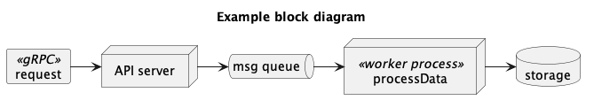
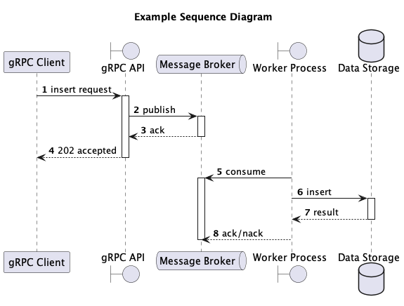

# Design

_TODO: Document the project's design, including diagrams and images that can be used as resources in this readme._

## About

_TODO: briefly describe the problem to be solved by this solution._

## Design considerations

_TODO: Add the exported diagram from [block-diagram.puml](./block-diagram.puml) here. Example:_

_TODO: Describe at a high-level the purpose of the application._

## Sequence and Data flow

_TODO: Add the exported diagram from [sequence-diagram.puml](./sequence-diagram.puml) here. Example:_

_TODO: Describe in a series of numbered steps the general "happy path" of how the solution works._

1. _first..._
2. _Then..._  
...and so on_

## Messages / Contracts

TODO: describe any messages - JSON schemas, protofiles, openApi.yaml, asyncApi.yaml
